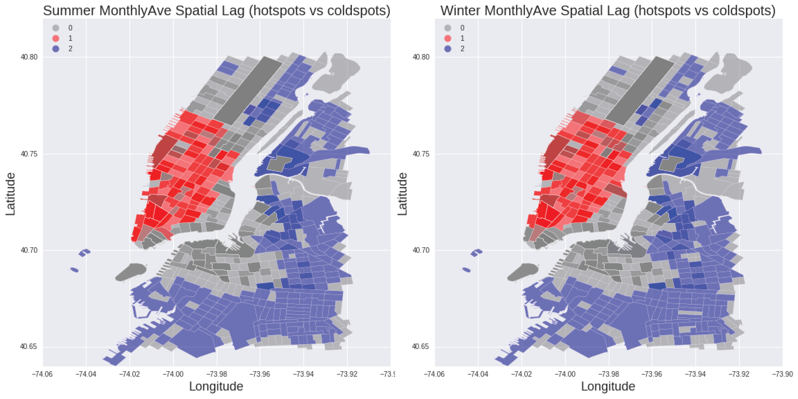

# PUI- Week 10 Assignment

#### Author: Avikal Somvanshi 

## Assignment 1: Finish Geo-Spatial Lab.

The lab work is attached.

## Assignment 2: Spatial Data Analysis (Seasonal)

Exploratory spatial data analysis of CitiBike data using pysal and geopandas for summer and winter months revaled that riderships are spatially segregated in both seasons. Winter months had a Moran's I statistics of 0.668 while summer months had a similar Moran's I statistics of 0.644. This implies that census tracts slightly are more spatially similar to one another in winter compared to the summer. This may be reflectly of the reduced cycling activities in cold winter months, especially the recreational type. Overall, the ridership hotspots are mostly located in lower Manhattan while the coldspots are spread across middle Manhattan, Brooklyn and Queens.

#### Figure: The spatial analysis of summer and winter ridership data of Citi Bike shows small difference in spatial distribution of hotspots and coldspots. There are slight more hotspots in winter (195) compared to summer (190). Meanwhile, the coldspots decline from summer (241) to winter (218). Based on this it can be inferred that knowing that there is a fall in the absolute ridership numbers in the winter therefore the spatial spread of ridership is slightly (though not significantly) thinner in winter. This drop in volume is leading to clubbing of hotspots and coldspots differently in winter than in summer, but not necessarily reflecting different spatial distribution.  

## Homework was done individually. 