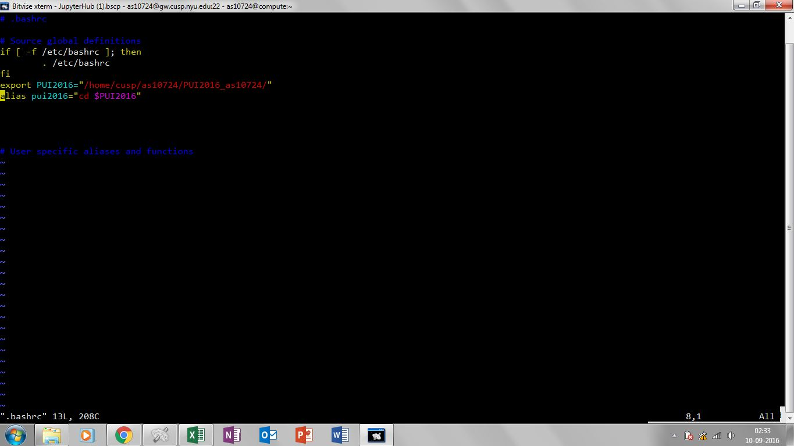

#PUI 2016 - Week One Homework

Assignment 1: Finish Lab 1

The assignment could not be finished in the class and had to be finished as part of the homework. I sort help in understanding the commands and working of github from Jonathan Pichot and Vishwajeet Shelar while I carried out initial forking exercise with Aaron D'Souza. Later I carried out forking exercise with Victor Gripp (forked each others' repo), Daniel Fay (forked his repo) and Sokratis Papadopoulos (forked my repo) for further practice. (Note: I named my text file as letsstart.txt instead of myfirstfile.txt)

I helped Alexey fork Enrique's repo.

Assignment 2: Set up your environment

The assignment was done with help from Daniel Fay, Vishwajeet Shelar and Achilles Saxby. 

The environment vairable was created using 'export' command which was inserted in the .bashrc file on my home directory on compute using 'vim' text editor. Then alias was defined by assigning the environment variable PUI2016 to alias pui2016.

