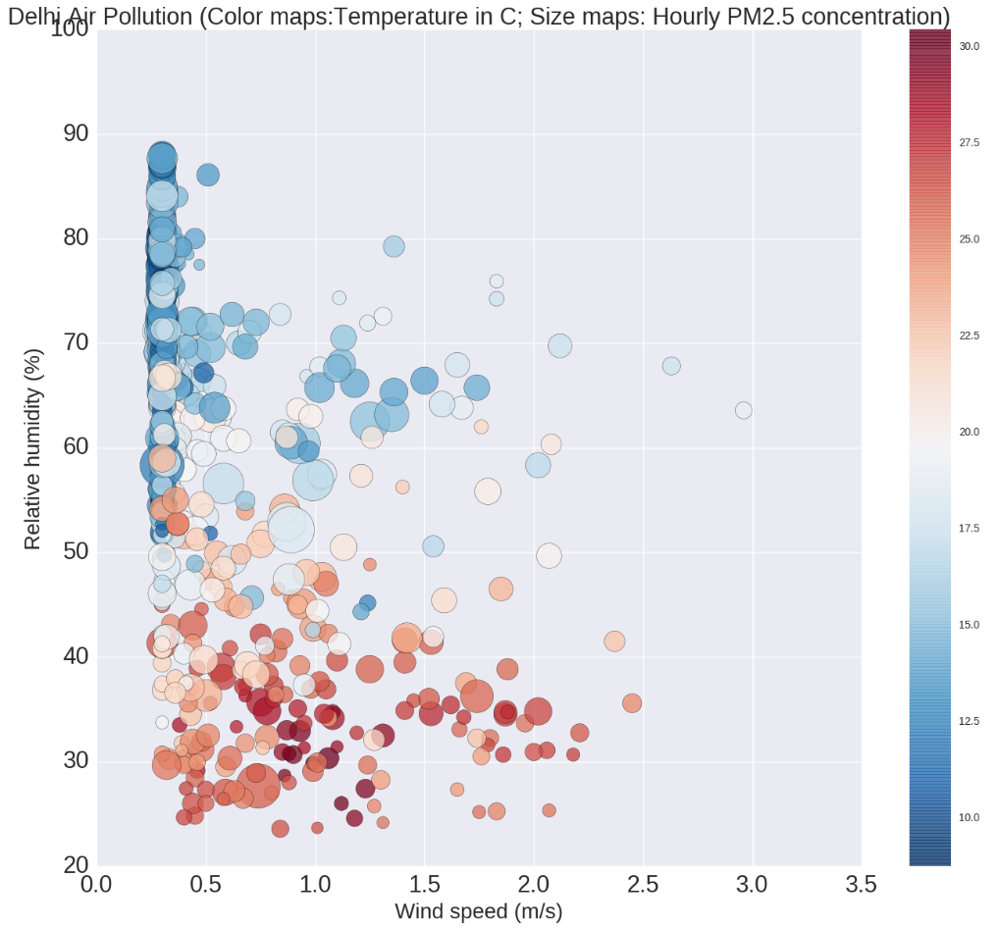
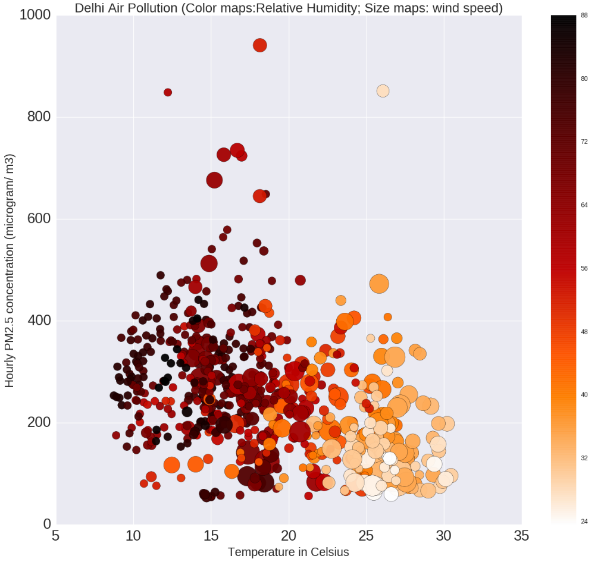
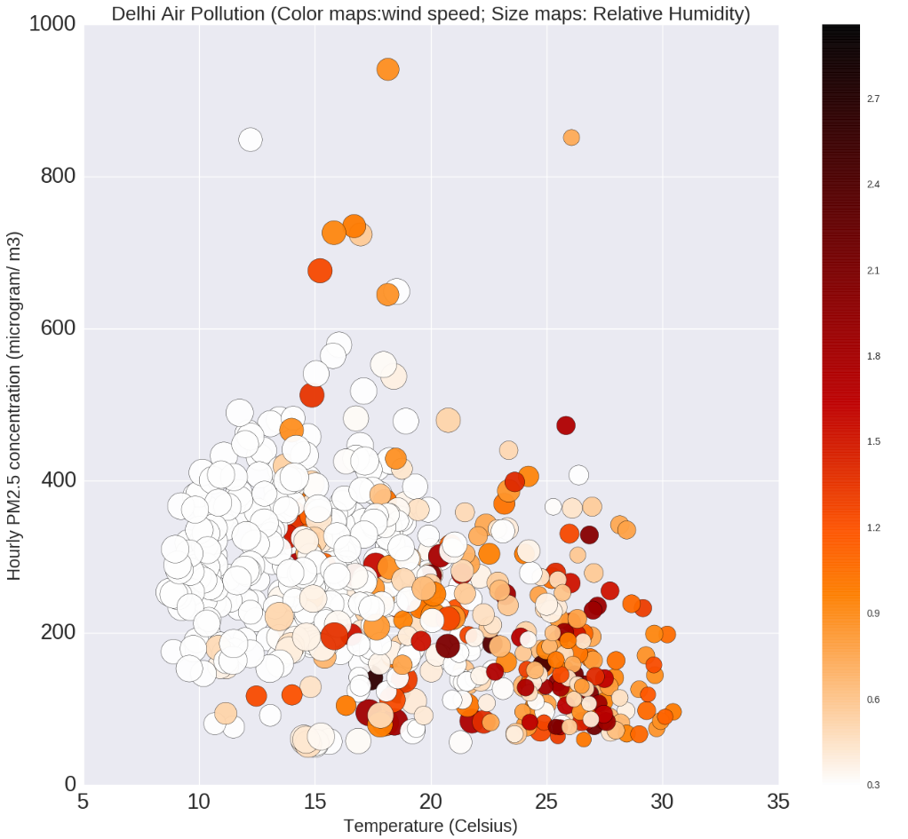
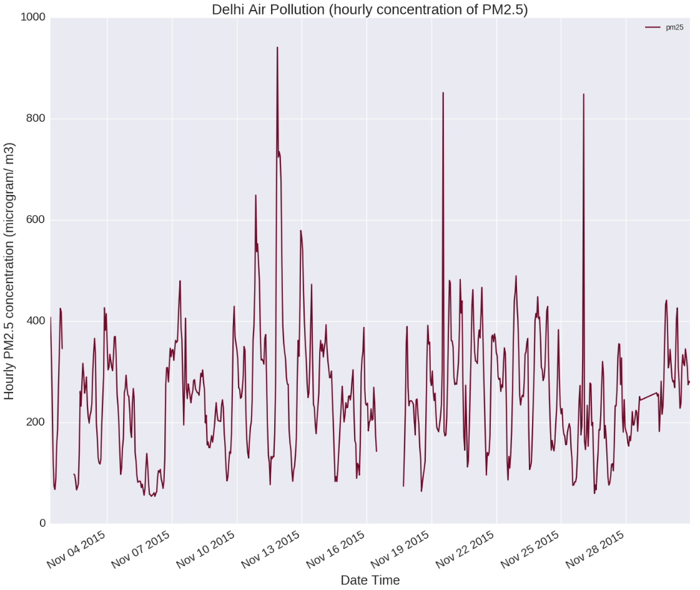

Hi Avikal, Great work with the plots!

## Figure 1: Impact of weather elements on the Winter air pollution levels in Delhi. The graph shows that the concentration of PM2.5 (bubble size) increases when wind speed is low, relative humidity is high and temperature is low. This is in accordance with the results of multivarient linear regression analysis carried out in this study.

## Figure 2: Impact of weather elements on the Winter air pollution levels in Delhi. The graph shows that the concentration of PM2.5 (y-axis) increases when wind speed(bubble size) is low, relative humidity (color) is high and temperature is low (a-axis). This is in accordance with the results of multivarient linear regression analysis carried out in this study.

## Figure 3: Impact of weather elements on the Winter air pollution levels in Delhi. The graph shows that the concentration of PM2.5 (y-axis) increases when wind speed(color) is low, relative humidity (bubble size) is high and temperature is low (x-axis). This is in accordance with the results of multivarient linear regression analysis carried out in this study.

## Figure 4: Hourly and daily variation in the concentration of PM2.5 in the air of Delhi in November 2015. 

# Comments: 
1) The Y-lable and title are overlapping in graph 1, which can be avoided.

2) The title and labels are easy to read and understand, you have mentioned the units which helps.

3) In graph 1, for the colour map, I would suggest a Monochrome as you have done in graph 2 and 3, which would help in better understanding the temperature varaitions.

4)The captions of the figures, explain the graphs well.

5)Good job using the color blind friendly color scheme

6)The timeseries graph caption can be more explantory

7)The graphs represent the data well.
