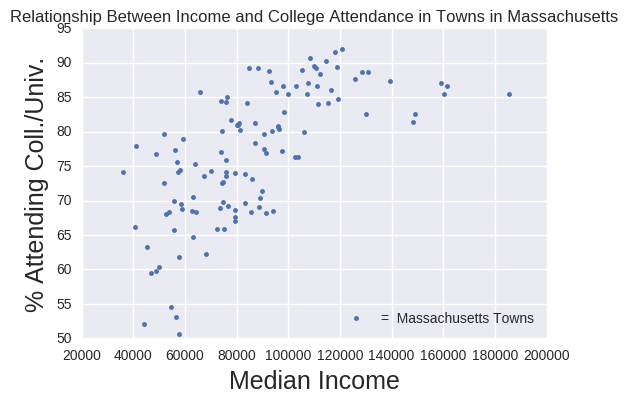

# PUI- Week 8 Assignment

## Review of Adrian's HW7 (the plot assignment)

#### Author: Avikal Somvanshi 

### CLARITY 

The plot is clean and easy to read. The quantities visualized are clear and effectively convey the information Adrian (hopefullly) intends to. Though the plot can use a caption.

### ESTHETIC

The plot leaves much to be desired in the area of esthetics. Fonts on plot are not scaled properly, for instance axes labels are disproportionately large compared to plot title and even plot size. Color wise, the plot has blue dots on lighter blue backdrop, which makes it a bit difficult on eyes. 

### HONESTY

The plot honestly reproduces the information contained in the data, though it would have been more impactful if a regression line was fitted to the plot. 

Overall, it is a decent graph which can be made better with some minor adjustment as suggested in this review.