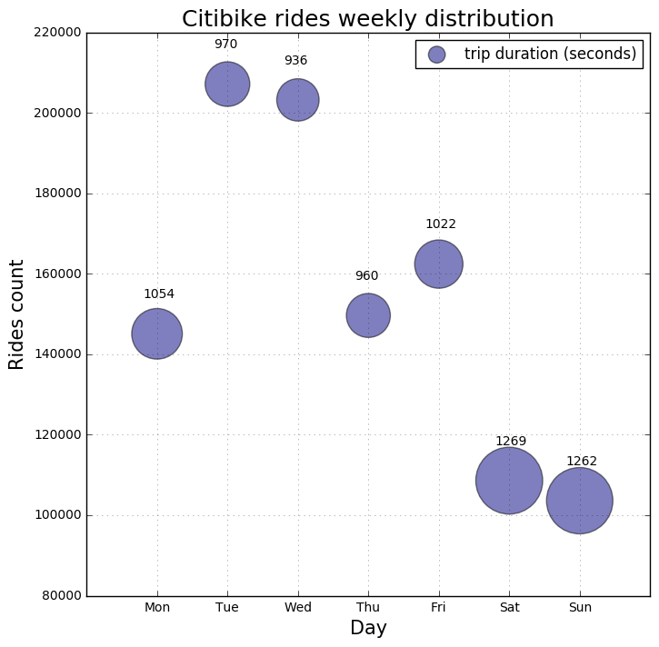

# PUI- Week 8 Assignment

## Review of Sokratis' HW7 (the plot assignment)

#### Author: Avikal Somvanshi 

Figure 1: Shows the weekly distribution of Citibike riders for September 2015. The size of the bubbles indicates the magnitude of average trip duration for the particular day of the week (the exact average trip duration value is indicated on top of each bubble). 

It is observed that the amount of rides is more on weekdays rather than weekdends, peaking on Tuesdays and Wednesdays. This could be attributed to the people who use bikes to commute. Additionally, despite the fact that ride counts on weekends is less, a higher average trip duration is observed. Such finding could be possibly attributed to the fact during weekends Citibike users are less binded by time in using bikes, and could give us hints regarding two possible users' categories, "commuting" and "recreational" riders.

### CLARITY 

The plot is clean and easy to read. The quantities visualized are clear and effectively convey the information Sokratis intends to. The plot caption is very helpful as well.

### ESTHETIC

The plot fairs well in the area of esthetics. Fonts are scaled properly and colors are easy on eyes. Further, there are no distractions and excessive graphics which makes it a very readable graph. 

### HONESTY

The plot honestly reproduces the information contained in the data. 

Overall, it is a very good graph.